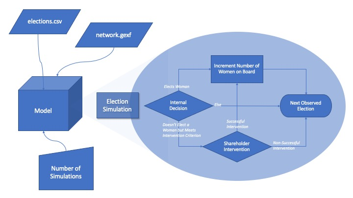

# Closing the Gap: Corporate Boards Add More Women when Interlocked with Diverse Peers
Suibhne Ó Foighil, 4/27/2022

## Introduction
This project is an extension of my senior thesis which researches the dynamics of gender diversification on corporate boards of directors. My thesis provides evidence that the progress towards gender equity has been uneven and clustered, suggesting the election of women directors is better explained by conformance to descriptive norms among a board&#39;s &#39;interlocked&#39; peers, over and above two more popular explanations: the business case for gender-diversity and normative pressure from shareholder activists.

## Problem Statement
In my thesis, I analyzed all elections to the boards of the S&amp;P 1500, from 2010 to 2020, and assume a specific measure captures the behavior of shareholder activists, who coerce un-diverse boards into electing women directors. If I recreate this behavior by simulating election outcomes and interventions by shareholder activists, can I generate the effect that I found empirically? I.e. does the measure actually capture the behavior I think it does?

To test this assumption, I simulate the outcomes of the observed elections, using probabilistic model to determine whether a board elects a woman director. The determinants are the social learning effect—the predominant finding of my thesis: where boards conform to descriptive norms for gender diversity among interlocked peers—as well as the level of shareholder interventions—where boards below a given threshold for gender diversity have some additional probability of electing a woman. Then, I regress on the simulated elections using as the independent variable of interest, and see how the effect varies in parameter space. I find the effect estimation for **does not** vary with the parameterized level of shareholder activism, suggesting, contrary to my thesis findings, the measure does not capture shareholder activism. However... I'm not sure how robust these findings are. Because I used a low-parameter behavioral model based on the average observed behavior, it could be the case that the boards targeted by shareholders play by different rules, causing the simulations to be a misrepresentation of the underlying data-generating process. To resolve this, I would implement a more nuanced model, to allow for more heterogenous behavior. Oh well, it was a school project :D. 

## Model Summary

